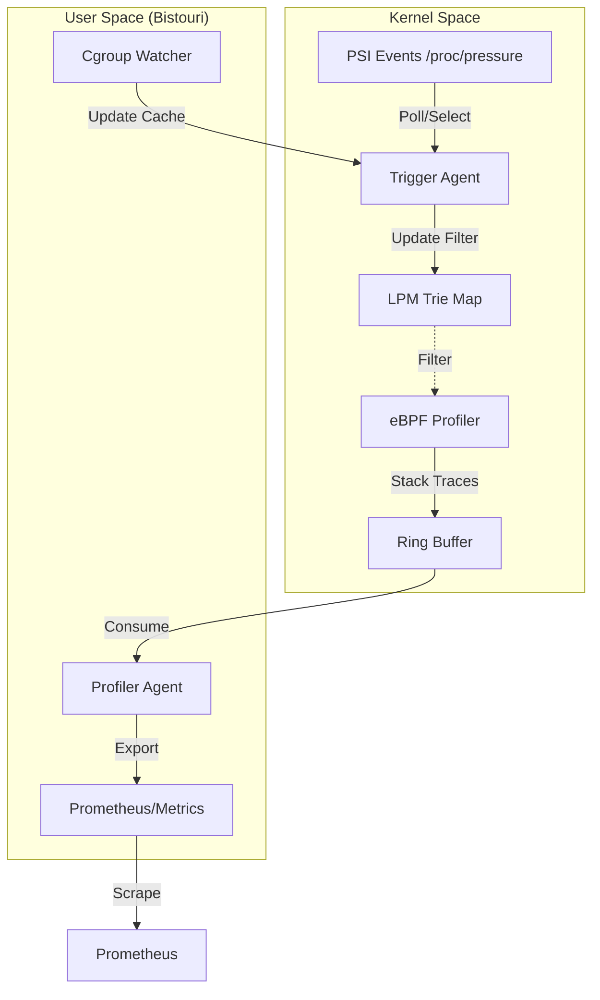

## What is Bistouri?

Bistouri—the French word for a surgical scalpel—is a profiling agent designed for precision intervention. Unlike continuous profilers that sample the entire fleet at a fixed frequency, Bistouri is reactive. It sits quietly in the background, consuming negligible resources, until the Linux kernel signals that a process is struggling.

The core premise is that profiling is most valuable when a system is under duress. By listening to Linux Pressure Stall Information (PSI) events, Bistouri identifies exactly when CPU, memory, or I/O pressure exceeds a defined threshold. It then dynamically activates eBPF-based stack capturing for the specific processes causing or suffering from that pressure. It is a tool for diagnosing the "why" of intermittent performance degradation without the "tax" of constant profiling.

## Why eBPF for Profiling?

Traditional profilers often rely on signals or ptrace, both of which introduce significant latency and can alter the timing of the very issues you are trying to debug. eBPF allows us to run profiling logic directly within the kernel’s interrupt context or at specific tracepoints with nanosecond overhead.

We chose eBPF because it provides a safe, programmable way to bridge the gap between high-level signals (like a cgroup's memory pressure) and low-level execution state (stack traces). By using eBPF maps, we can communicate from user-space to the kernel which processes are "interesting" in real-time. This allows the agent to remain dormant until a PSI trigger occurs, at which point it simply flips a bit in a BPF map to start collecting data.

## Architecture at a Glance

Bistouri is built on a "three-phase" initialization pattern to manage the complex lifecycle of eBPF programs and their dependencies on the host system.

1.  **Preparation:** We first parse configurations and initialize the `TriggerAgent`. This stage has no BPF dependencies. It sets up the asynchronous watchers (like PSI file descriptors) and communication channels.
2.  **Loading:** The `ProfilerAgent` loads the eBPF bytecode into the kernel. At this point, the BPF programs are resident but essentially "blind"—they don't yet know which processes to profile.
3.  **Activation:** We pass the BPF map handles (specifically a Longest Prefix Match trie) from the `ProfilerAgent` to the `TriggerAgent`. Now, when a PSI event fires, the trigger system can write process identifiers directly into the BPF maps, effectively "arming" the profiler for specific targets.

This separation ensures that we don't load heavy BPF objects until we are sure the configuration is valid, and it allows the user-space event loop to remain decoupled from the kernel-space data collection.

## Component Map

The following diagram illustrates how pressure events flow from the kernel, through our reactive logic, and back into the kernel to trigger stack captures.

## The Event Pipeline

The pipeline is designed to be "eventually consistent." When a cgroup or process starts experiencing pressure, the following sequence occurs:

1.  **The Trigger:** The Linux kernel wakes up our `TriggerAgent` via a `poll()` on a PSI file descriptor.
2.  **The Resolution:** The agent looks up the relevant process metadata in a shared `CgroupCache`. This cache is maintained by a background watcher task that tracks the lifecycle of cgroups, ensuring we don't have to walk `/proc` on every single event.
3.  **The Filtering:** We use a Longest Prefix Match (LPM) Trie in BPF. This is a deliberate choice: it allows us to filter by specific process names or cgroup paths with high efficiency. The `TriggerAgent` updates this trie in real-time.
4.  **The Capture:** The BPF program, triggered by a timer or tracepoint, checks the LPM trie. If the current task matches a "hot" entry, it captures the stack trace and pushes it into a high-performance Ring Buffer.
5.  **The Consumption:** A dedicated blocking thread in user-space drains the ring buffer, serializing the data for external analysis.

## Design Principles

-   **Event Loop Integrity:** We use a multi-threaded Tokio runtime, but we strictly separate IO-bound tasks from blocking tasks. Since the eBPF ring buffer must be polled synchronously, we dedicate a thread to it via `spawn_blocking` to ensure the primary async loop remains responsive to new PSI events.
-   **Minimal Threading Budget:** By default, Bistouri runs on a skeleton crew—one worker thread for IO and one for blocking. This is a "conservative by default" stance; we want the profiling tool to be the last thing contributing to the system pressure it's trying to measure.
-   **Safety and Observability:** We use `repr(C)` structs to share memory between Rust and C, and we expose internal health (like how many events we've processed or how many BPF errors occurred) via a Prometheus endpoint on port 9464.

## Key Tradeoffs

-   **LPM Trie vs. Hash Maps:** We chose an LPM Trie for filtering. While a Hash Map might be slightly faster for exact PID matches, the Trie allows us to define "pressure policies" based on cgroup hierarchies or process name prefixes, providing much greater flexibility in containerized environments.
-   **Eventual Consistency:** There is a tiny window where a process might start experiencing pressure but the user-space agent hasn't yet updated the BPF map. We accept this "lost sample" at the very start of a pressure spike in exchange for not having the BPF program perform complex lookups itself.
-   **User-space Triggering:** One might ask why we don't trigger the profiler entirely in the kernel. The answer is policy. Defining what constitutes "too much pressure" often involves complex configuration and metadata (like container names) that is significantly easier and safer to manage in Rust than in C-based BPF code.

---
_Auto-generated from commit `9287f83` by Gemini 3.1 Pro.
Last updated: 2026-05-07_